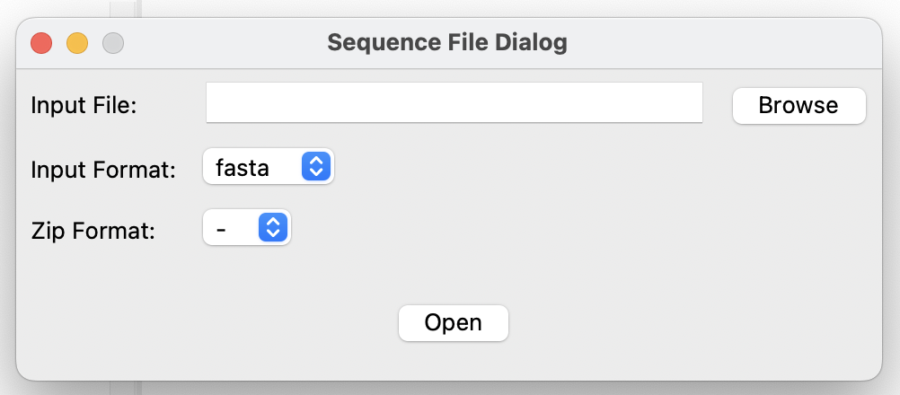

# User Manual

## Table of Contents
- [File](#file)  
  - [Open Sequence File](#open-sequence-file)  
  - [Open Sequence File as Index](#open-sequence-file-as-index)  
  - [Open Alignment File](#open-alignment-file)  
  - [Save File](#save-file)  
  - [Convert Sequence File Format](#convert-sequence-file-format)  
  - [Convert Alignment File Format](#convert-alignment-file-format)  
  - [Settings](#settings)   
- [Edit](#edit)  
- [Select](#select)  
- [View](#view)  
- [Sequence](#sequence)  
- [Alignment](#alignment)  
- [Annotation](#annotation)  
  - [Information Tab](#information-tab)  
  - [Annotations Tab](#annotations-tab)  
  - [Features Tab](#features-tab)  
  - [Letter Annotation Tab](#letter-annotation-tab)  
  - [Database Cross-References Tab](#database-cross-references-tab)  
- [Phylogenetic Tree](#phylogenetic-tree)  
- [Motif](#motif)  
- [Other Tools](#other-tools)

---

## File
### Open Sequence File

This feature allows users to open a sequence file. The application identifies the file as a **Sequence**, meaning it contains unaligned sequences rather than an alignment file. Each sequence is treated independently and can be of any type (DNA, RNA, or Protein) with varying lengths.

The tool supports 34 file formats, including:  
`abi, abi-trim, ace, fasta, fasta-2line, ig, embl, embl-cds, gb, gck, genbank, genbank-cds, imgt, nib, cif-seqres, cif-atom, pdb-atom, pdb-seqres, phd, pir, fastq, fastq-sanger, fastq-solexa, fastq-illumina, qual, seqxml, sff, snapgene, sff-trim, swiss, tab, twobit, uniprot-xml, xdna`.  

Additionally, compressed formats (`.gz`, `.bz2`) are supported.

#### Sequence File Dialog Window

Once opened, the file is displayed in the application.  

- **Left Panel:** Shows sequence names or IDs.  
- **Right Panel:** Displays sequence content, with a ruler marking every 10th position.  
- **Bottom Panel:** Indicates file type (`Sequence` or `Alignment`). Some editing options are specific to each type. The right side shows real-time row and column values.

#### Sequence Viewer Window  

### Open Sequence File as Index

Index mode allows the user to open large datasets that exceed RAM limitations. However, editing capabilities are restricted in this mode (As you can see, some menu items are disabled). 

The supported formats include 19 file types:  
`ace, embl, fasta, fastq, fastq-sanger, fastq-solexa, fastq-illumina, genbank, gb, ig, imgt, phd, pir, sff, sff-trim, swiss, tab, qual, uniprot-xml`.

### Open Alignment File

This feature allows the user to open an alignment file and sets the file type to **Alignment**. Alignment files require sequences to have a fixed size, as they are part of an alignment. The alignment sequences are displayed the same way as sequence files.

No zip formats are supported for alignment files. The supported formats are:  
`clustal, emboss, fasta, fasta-m10, ig, maf, mauve, msf, nexus, phylip, phylip-sequential, phylip-relaxed, stockholm`.

Typically, a file contains a single alignment. However, if the file contains multiple alignments, a selector is provided to choose an alignment based on its order in the file.

#### Alignment Selector  

### Save File

This option allows the user to save the currently worked file. During the save process, the user is prompted to select which annotations to keep. Annotations that are not supported by the selected format will be omitted.

#### Supported Formats for Sequence Files:  
`fasta, fasta-2line, gb, genbank, embl, imgt, nib, phd, pir, fastq, fastq-sanger, fastq-solexa, fastq-illumina, qual, seqxml, sff, tab, xdna`.

#### Supported Formats for Alignment Files:  
`clustal, maf, mauve, nexus, phylip, phylip-sequential, phylip-relaxed, stockholm`.

#### Save Window  

### Convert Sequence File Format

This option allows the user to convert the format of a sequence file without the need to open it. The process is memory-efficient, as records are read and written one by one, without loading the entire file into memory. This ensures that large files can be converted without overwhelming system resources.

The input formats for this option are the same as those in the **Open Sequence File** option. The output formats available for conversion are the same as those supported in the **Save File** option for sequence files.

#### Convert Sequence Window  

### Convert Alignment File Format

This option allows the user to convert an alignment file from one format to another without opening it.
The input formats for this option are the same as those in the **Open Alignment File** option. The output formats available for conversion are the same as those supported in the **Save File** option for alignment files.

#### Convert Alignment Window  

### Settings

This menu item opens a configuration interface with several tabs: **General**, **Alignment Tools**, **Tree Tools**, and **Other Tools**.

- **General**: This tab provides general application settings. The available options are explained throughout the document as related sections appear.

- **Alignment Tools**: In this tab, the user can configure external alignment tool parameters. Currently, the application supports interfaces to these tools for multiple sequence alignment: **Muscle**, **ClustalOmega**, **Prank**, **Mafft**, **Probcons**, **MSAProbs**. For pairwise alignment, **Needleman-Wunsch** and **Smith-Waterman** from the EMBOSS package are available. Users can specify input, output, and output file format for MSA, as well as gap open and gap extension parameters for pairwise alignments.

- **Tree Tools**: This tab allows users to configure external tree tool parameters. The application supports **RAxML** and **FastTree** for phylogenetic tree inference, with **FigTree** for visualization. Users can specify input and output file parameters, along with additional tool-specific options.

- **Other Tools**: In this tab, users can add custom external tools by entering their respective commands. This provides immediate access to the user's preferred bioinformatics programs, which can be executed later via the **Other Tools** menu.
 

## Edit
(Describe editing functions here)

## Select
(Explain selection options here)

## View
(Describe viewing options here)

## Sequence
(Explain sequence-related features here)

## Alignment
(Describe alignment functionalities here)

## Annotation

### Information Tab
(Describe the purpose of the information tab)

### Annotations Tab
(Explain how to view and manage annotations)

### Features Tab
(Describe the feature-related options)

### Letter Annotation Tab
(Explain letter-level annotations)

### Database Cross-References Tab
(Describe database linking features)

## Phylogenetic Tree
(Explain phylogenetic tree functionalities)

## Motif
(Describe motif-related tools)

## Other Tools
(Explain any additional tools available)
